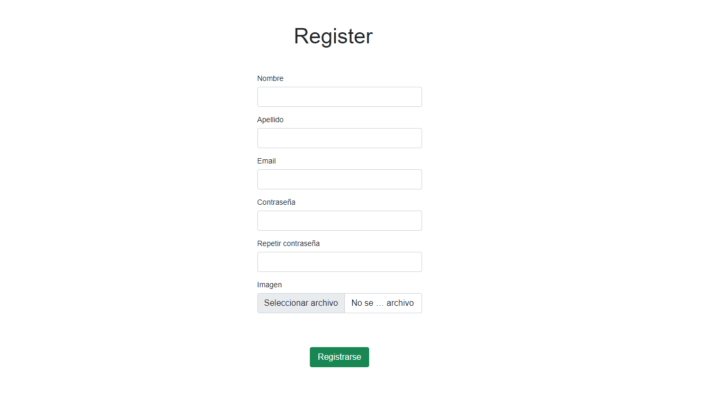

# Sistema de Registración v1
Introducción
En esta oportunidad vamos a dejar de lado por un momento los productos y te
pediremos que te enfoqués ahora en el registro de usuarios.
En este momento queremos relativamente algo sencillo. Un formulario de registro que
le permita cada persona registrarse en nuestro sistema.
Así que tu misión en esta oportunidad será desarrollar dicha funcionalidad, pues
nuestros inversores siguen estando satisfechos con tus resultados.
  
## Requisitos
- GET y POST: todo sistema de registro de usuarios usa estos dos métodos, así que si
aún tenés dudas con alguno de ellos, te recomendados tener todo lo más claro posible
antes de empezar.
- Hasheo y Subida de archivos: ningún sistema de registro de usuarios será del todo
seguro y completo si no encripta la contraseña de la persona que se registra. Y así
mismo, si quien se registra no posee un avatar. Es por ello que necesitás tener en claro
esto antes de arrancar.
  
## Objetivo
Para la construcción de esta versión del aplicativo, esperamos contar con la posibilidad
de acceso a las siguientes URL's:
  
  - / register (GET) ○ Mostrará el formulario de registro de usuario con los campos:
  - Nombre
  - Apellido
  - Email
  - Contraseña
  - Repetir Contraseña
  - Avatar (subida de archivos de imagen)
  
  - /profile (GET) ○ A esta sección se deberá llevar al usuario cuando el mismo haya
completado su proceso de registro. Esta sección deberá mostrar: nombre
del usuario, su email y su avatar.
¡Atención! tené en cuenta que algunos endpoints de tipo POST no se relacionan en el
punto anterior, pero para el funcionamiento del sistema, es necesaria su existencia.
  
## Consignas
A continuación se detalla lo que deberá mostrar cada ruta.
1. Sobre la interfaz
De momento no queremos que la interfaz tenga ningún estilo visual específico,
así que por esta vez podés escapar del CSS.
2. Sobre el desarrollo
De momento no queremos algo "tan" estructurado, desde que el sistema registre
usuarios con sus correspondientes avatares, estaremos más que bien.
3. Sobre los requerimientos técnicos
Como siempre, queremos que todo ande bajo un esquema de Node y Express. Y
que las personas registradas se persistan en un archivo JSON. Así mismo
queremos que los avatares de las personas registradas se suban correctamente
al servidor y que se puedan relacionar los mismos con los datos de cada
persona.

  - Como plus quisiéramos que las personas registradas no se pudieran
registrar más de una vez con el mismo correo electrónico.

  - Como plus quisiéramos que la ruta /profile pudiera ser accedida también
desde un formulario de login.
Teniendo en claro esto, te recomendamos que revisés todo antes de arrancar. Así de
esa manera vas a saber exactamente qué hacer y qué no hacer.
¡Mucha suerte!
